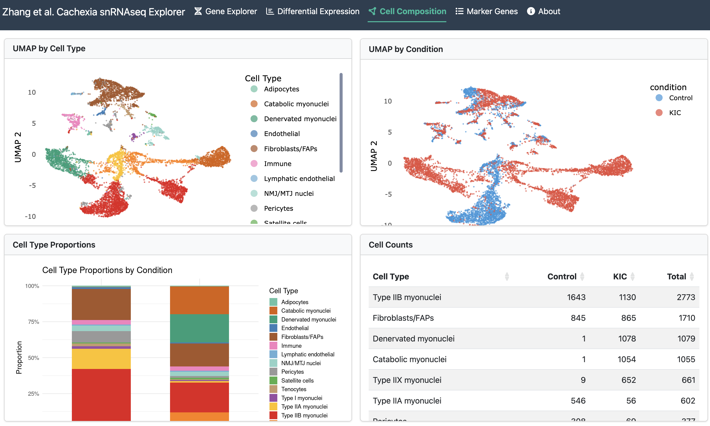

# Zhang et al. Cachexia snRNAseq Shiny Explorer

**Live App: [zhang-cachexia-explorer](https://gammon.shinyapps.io/zhang-cachexia-explorer/)**

Interactive Shiny app for exploring single-nucleus RNA-seq data from Zhang et al. (Cell Reports, 2024; PMID 39116208). The study performed snRNA-seq on mouse gastrocnemius-plantaris skeletal muscle comparing **control** vs **KIC cachexia** model mice.

**GEO Accession:** [GSE272083](https://www.ncbi.nlm.nih.gov/geo/query/acc.cgi?acc=GSE272083) (snRNA-seq sub-series: GSE272085)

## What This Does

Search any gene and instantly see its expression across 15 cell types on UMAP, split by control vs cachexia condition. Browse per-cell-type differential expression results with interactive volcano plots, compare cell type proportions between conditions, and explore marker gene signatures with customizable dot plots and heatmaps. All plots are downloadable as PDF. Designed so lab members can explore the dataset without needing computational expertise.



## Methods

9,379 nuclei (3,914 control + 5,465 KIC) were processed with Seurat v5. SCTransform v2 was used for normalization, clustering (Louvain, resolution 0.5, 30 PCs), and UMAP embedding; the SCT-normalized expression matrix is what the app displays. Differential expression uses Wilcoxon rank-sum tests on log-normalized RNA assay data (standard `NormalizeData`) to avoid SCT multi-model correction issues across conditions. Cell types were annotated using canonical marker panels validated against the original publication. The Shiny app loads only pre-computed sparse matrices and data frames (no Seurat dependency at runtime) for fast startup.

## Cell Types

15 populations identified, including 6 myonuclei subtypes:

- **Fiber-type myonuclei:** Type I, Type IIA, Type IIB, Type IIX
- **Cachexia-specific myonuclei:** Denervated myonuclei (Ncam1+/Runx1+/Gadd45a+, ~20% of KIC nuclei) and Catabolic myonuclei (Fbxo32+/Trim63+, ~19% of KIC nuclei) — these KIC-exclusive populations drive the muscle atrophy phenotype via the myogenin-myostatin pathway described in the paper
- **Non-muscle:** Fibroblasts/FAPs, endothelial, lymphatic endothelial, tenocytes, immune, pericytes, satellite cells, adipocytes, NMJ/MTJ nuclei

## Setup

```bash
# Create conda environment
conda env create -f environment.yml
conda activate zhang_shiny

# Install presto (fast Wilcoxon tests)
Rscript -e 'remotes::install_github("immunogenomics/presto")'

# Download raw data
bash data/raw/download_data.sh
```

## Analysis Pipeline

Run scripts sequentially:

```bash
cd analysis
Rscript 01_qc_and_preprocessing.R
Rscript 02_integration.R
Rscript 03_clustering.R
Rscript 04_annotation.R
Rscript 05_differential_expression.R
Rscript 06_prepare_shiny_data.R
```

## Launch Shiny App

```bash
Rscript -e 'shiny::runApp("app/")'
```

## Deployment

```r
# shinyapps.io
rsconnect::deployApp("app/", appName = "zhang-cachexia-explorer")
```

App deploys at: https://gammon.shinyapps.io/zhang-cachexia-explorer/

## Citation

Zhang et al. "A myogenin-myostatin pathway drives cancer cachexia-induced muscle atrophy." Cell Reports, 2024. PMID: 39116208.
